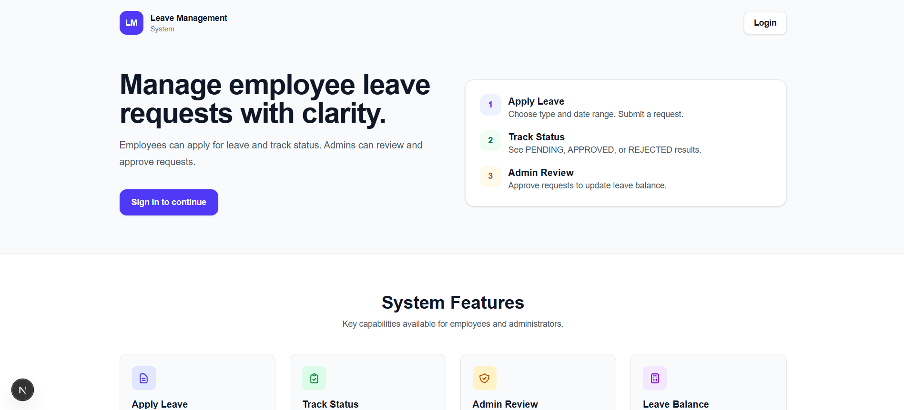
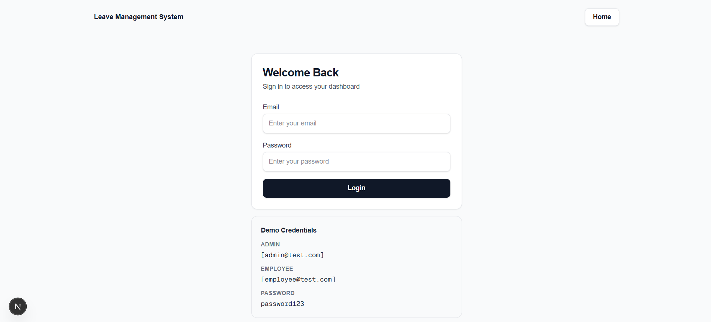
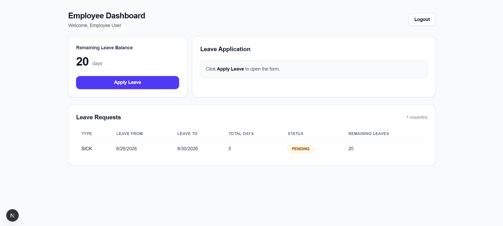
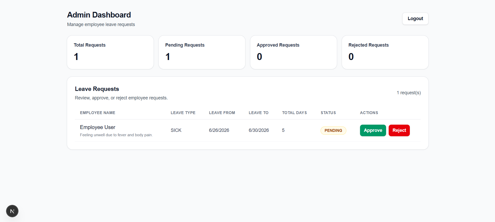

# Leave Management System

## Overview
This is a simple employee leave management web app built with **Next.js (App Router)**, **TypeScript**, **Tailwind CSS**, and **Prisma** (SQLite). It supports:
- Employees applying for leave requests.
- Admins reviewing requests and updating their status.
- Automatic leave balance decrement when a request is approved.

Authentication is implemented using **HTTP-only cookies** containing user id, role, and name.

## Features

| Area | Feature | Implementation Notes |
|---|---|---|
| Authentication | Login via `/api/auth/login` | Uses `bcryptjs` to verify password; stores `userId`, `userRole`, `userName` in HTTP-only cookies. |
| Logout | Logout via `/api/auth/logout` | Clears those cookies. |
| Authorization | Route protection for `/admin/*` and `/employee/*` | `src/middleware.ts` checks `userRole` cookie and redirects to `/login` if unauthorized. |
| Employee | Apply for leave | `POST /api/leaves` (requires `role === "EMPLOYEE"`). |
| Employee | View leave requests | `GET /api/leaves` returns only the logged-in user’s leaves (unless admin). |
| Admin | Review requests | `GET /api/leaves` returns all requests for admins. |
| Admin | Approve/Reject | `PATCH /api/leaves/:id` updates `status`. |
| Leave accounting | Decrement balance on approval | In `PATCH /api/leaves/:id`, if changing **PENDING → APPROVED**, it decrements the employee `leaveBalance` by total days. |

### Leave Statuses
- `PENDING` (default)
- `APPROVED`
- `REJECTED`

## Tech Stack

| Category | Tech |
|---|---|
| Web framework | Next.js 16 (App Router) |
| Language | TypeScript |
| UI styling | Tailwind CSS |
| Database | SQLite |
| ORM | Prisma |
| Auth primitives | bcryptjs, jsonwebtoken (dependencies present), cookie-based session |
| Data access | Prisma Client |

## Setup Instructions

### 1) Install dependencies
```bash
npm install
```

### 2) Configure environment variables
The Prisma schema expects `DATABASE_URL`.

Create a `.env` file in the project root (example):
```env
DATABASE_URL="file:./prisma/dev.db"
```

> The repository includes `prisma/dev.db`, but you still need `DATABASE_URL` for Prisma.

### 3) Initialize / seed the database
Run the Prisma seed script:
```bash
npx prisma db push
npm run seed
```

(Seed creates demo users.)

### 4) Run the app
```bash
npm run dev
```

Then open `http://localhost:3000`.

## Project Structure

```text
.
├─ prisma/
│  ├─ schema.prisma
│  ├─ seed.ts
│  ├─ dev.db
│  └─ migrations/
├─ public/
├─ src/
│  ├─ middleware.ts
│  ├─ app/
│  │  ├─ layout.tsx
│  │  ├─ page.tsx
│  │  ├─ login/
│  │  │  └─ page.tsx
│  │  ├─ admin/
│  │  │  └─ page.tsx
│  │  ├─ employee/
│  │  │  └─ page.tsx
│  │  └─ api/
│  │     ├─ auth/
│  │     │  ├─ login/
│  │     │  │  └─ route.ts
│  │     │  └─ logout/
│  │     │     └─ route.ts
│  │     ├─ leaves/
│  │     │  ├─ route.ts
│  │     │  └─ [id]/
│  │     │     └─ route.ts
│  │     └─ me/
│  │        └─ route.ts
│  └─ lib/
│     └─ prisma.ts
├─ package.json
└─ README.md
```

## Architecture

### High-level flow
1. **Login**: User submits credentials on `/login`.
2. **Session**: `/api/auth/login` sets HTTP-only cookies: `userId`, `userRole`, `userName`.
3. **Authorization**: `middleware.ts` protects `/admin/*` and `/employee/*` based on `userRole` cookie.
4. **Leave operations**:
   - Employees call `POST /api/leaves` to create a `PENDING` leave request.
   - Admins call `PATCH /api/leaves/:id` to set `APPROVED` or `REJECTED`.
5. **Balance update**: When a leave transitions from `PENDING` to `APPROVED`, `leaveBalance` is decremented by computed total days.

### Data model (Prisma)

| Model | Fields (relevant) |
|---|---|
| `User` | `id`, `name`, `email` (unique), `password`, `role`, `leaveBalance` (default `20`) |
| `Leave` | `id`, `userId`, `type`, `reason`, `startDate`, `endDate`, `status` (default `PENDING`), `createdAt` |

## Leave Approval Workflow

### Employee: Submit request
- UI: `src/app/employee/page.tsx` toggles “Apply Leave” form.
- API: `POST /api/leaves`
  - Validates role: must be `EMPLOYEE`.
  - Validates payload: `type`, `reason`, and valid dates; rejects invalid ranges (`start > end`).
  - Creates a new `Leave` with `status = "PENDING"`.

### Admin: Review requests
- UI: `src/app/admin/page.tsx` fetches all leave requests using `GET /api/leaves`.
- Rendering includes status badges and (when available) start/end dates and computed total days.

### Admin: Approve or Reject
- API: `PATCH /api/leaves/:id`
  - Loads the leave by id; returns `404` if not found.
  - Updates the leave `status`.
  - **Only on approve from `PENDING` → `APPROVED`** it decrements the employee `leaveBalance`.

### Balance calculation
In `PATCH /api/leaves/:id`, total days are computed as:
- Normalize both `startDate` and `endDate` to local midnight (to reduce DST/timezone edge cases).
- `totalDays = floor((endMidnight - startMidnight) / 1day) + 1`
- Decrement uses Prisma: `leaveBalance: { decrement: totalDays }`.

## AI Usage
No AI/LLM integration exists in this implementation.
- No AI-related runtime calls are present.
- No AI-specific dependencies or API integrations are used.

## Assumptions
- Leave types are expected to be one of: `SICK`, `VACATION`, `PERSONAL`, `OTHER` (as used by the employee UI).
- Status values are expected to be one of: `PENDING`, `APPROVED`, `REJECTED`.
- Authentication state is cookie-based; there is no token refresh flow.
- All date inputs are interpreted on the server as JavaScript `Date` values derived from the client’s `YYYY-MM-DD` strings.

## Demo Credentials
These credentials are displayed on the login page (`src/app/login/page.tsx`) and created by `prisma/seed.ts`:

| Role | Email | Password |
|---|---|---|
| Admin | `admin@test.com` | `password123` |
| Employee | `employee@test.com` | `password123` |

## Future Improvements
- Add stronger authorization checks for leave status updates (currently `PATCH /api/leaves/:id` does not verify caller role).
- Add validation preventing nonsensical date ranges beyond `start > end` (e.g., past dates, overlapping policy).
- Add UI improvements for admin: confirm dialogs and error handling for mutation failures.
- Add pagination/filtering for `/api/leaves` results.
- Improve security around cookies (e.g., `secure` flag in production) and CSRF protections.

## Screenshot Placeholders

> Add screenshots of these pages:

| Page | Placeholder |
|---|---|
| Landing (`/`) |  |
| Login (`/login`) |  |
| Employee dashboard (`/employee`) |  |
| Admin dashboard (`/admin`) |  |

## License
MIT

